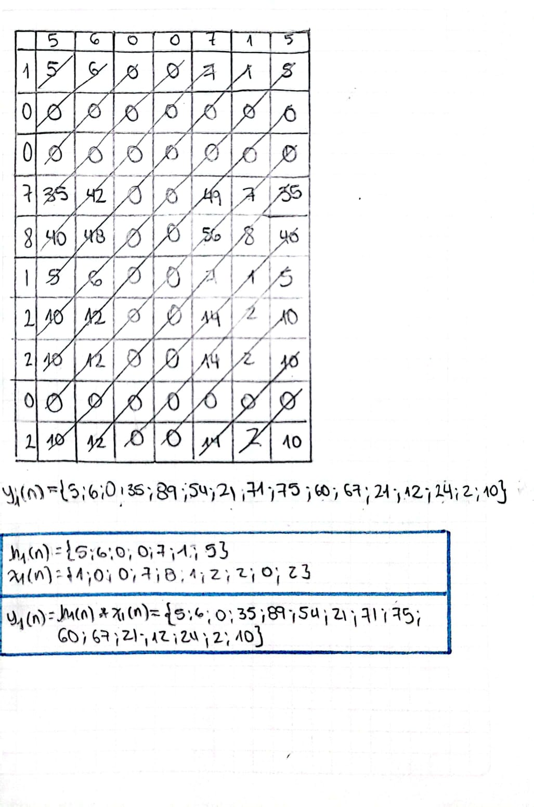
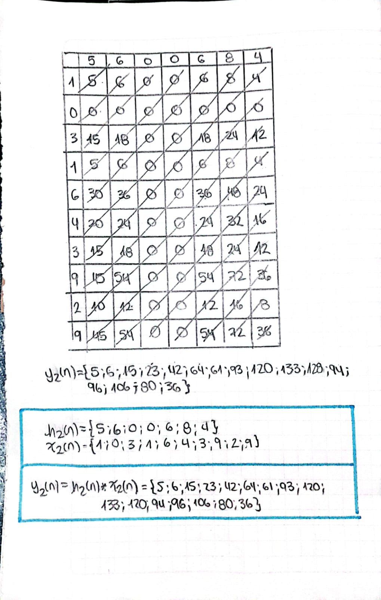
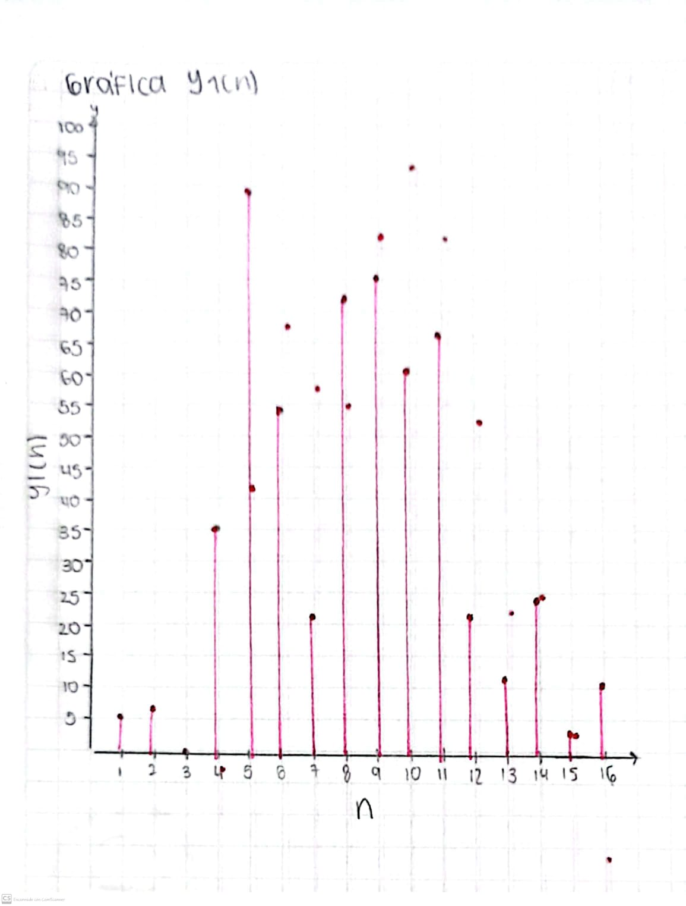
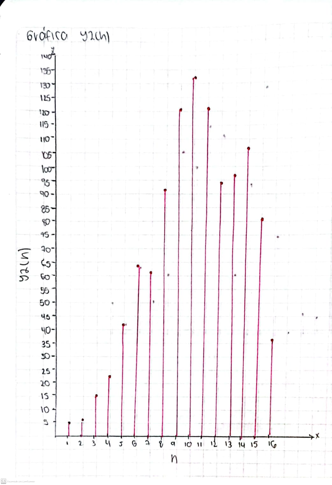
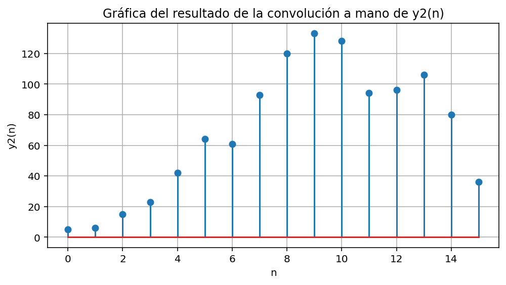
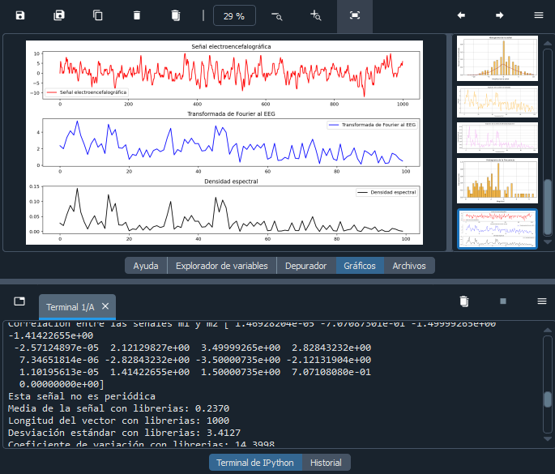

# LAB-2-PDS

## Descripción

Con el objetivo de lograr reconocer la convolución como una operación que logre integrar la señal y el sistema, y a su vez, utilizar la transformada como una herramienta para analizar el dominio de la frecuencia, se presenta el siguiente informe de laboratorio “Convolución, correlación y transformación”. 

## Desarrollo

### Punto A 
#### I.
La convolución es una operación matemática que se puede utilizar en algunas aplicaciones como el filtrado y matemáticamente se define como.  

y[n] = x[n]*h[n]  

Toma dos señales, una de entrada llamada x(n), y una de respuesta del sistema, convirtiéndolas en una señal nueva que será la de salida llamada y(n); un ejemplo de esto puede ser un sistema de filtración, tomando en este caso una señal EMG que por la ausencia de filtros electrónicos tendrá mucho ruido, por lo que se necesita tomar la señal de entrada, que corresponde a la señal electromiográfica con ruido, y tomar el filtro digital como la función de respuesta del sistema y(n), por consiguiente, la convolución entre estas dos va a ser la señal EMG de salida, es decir estará limpia.  

Para este ítem, se hará la convolución entre la señal de entrada y la función de respuesta del sistema, que en este caso la señal tomada serán los códigos de los integrantes del grupo, siendo la señal de entrada x(n) la señal que producen los dígitos del número de identificación de cada uno, como se muestra a continuación.  

Para hallar la convolución entre las dos tablas a mano se hizo un procedimiento visto en clase llamado "tabla de algoritmos de convolución" que ayuda a que este proceso matemático se calcule con mayor facilidad. Para realizar esto, en la primera fila se ubica la señal de entrada numéricamente, y en la columna 1 la señal de respuesta del sistema, para a continuación multiplicarla y sumarla de manera diagonal como si fuera el cálculo de determinantes.

#### II.

En este punto para graficar la señal de salida, se ubica la señal de salida en el eje y en función del número de muestras que fueron tomadas y se posiciona en el eje x, como se muestra a continuación.

#### III.
En este ítem se hizo el cálculo y la gráfica por medio de python, del cálculo realizado anteriormente a mano, obteniendo el siguiente código:

     # Gráfico convolución por python
     y11 = np.convolve(x1, h1, mode='full');
     t7 = np.arange(len(y11)) 
     plt.figure(figsize=(8, 4))
     plt.stem(t7, y11)
     plt.xlabel('n')
     plt.ylabel('y1(n)')
     plt.title('Gráfica de la convolución y1(n) por Python')
     plt.grid()
     plt.show()
Se utilizó la función "np.convolve(x1, h1, mode='full');" para poder integrar y realizar el cálculo de la convolución entre la señal de entrada y la respuesta del impulso, siendo nombrada la salida como "y11"; finalmente se imprime la gráfica con las funciones "plt.figure" y "plt.stem", replicándose de igual manera para la segunda señal:

     # Gráfico convolución con python
     y22 = np.convolve(x2, h2, mode='full');

     t8 = np.arange(len(y22)) 
     plt.figure(figsize=(8, 4))
     plt.stem(t8, y22)
     plt.xlabel('n')
     plt.ylabel('y2(n)')
     plt.title('Gráfica de la convolución y2(n) por Python')
     plt.grid()
     plt.show()
Por medio del código se puede evidenciar el cálculo de la señal de salida y la gráfica de convolución.
A continuación se observa la gráfica de la señal h(n) de Juan Diego.

A continuación se observa la gráfica de la señal x(n) de Juan Diego.

A continuación se observa la gráfica de la convolución correspondiente.

A continuación se observa la gráfica de la convolución por medio de python.

Estos mismos pasos son replicados para las gráficas de las segundas señales, es decir las de Sofia Olivella:
A continuación se observa la gráfica de la señal h(n) de Sofia.

A continuación se observa la gráfica de la señal x(n) de Sofia.

A continuación se observa la gráfica de la convolución correspondiente.

A continuación se observa la gráfica de la convolución por medio de python.

### Punto B
Para el estudio de la correlación cruzada que se puede obtener entre dos variables, se usan dos señales m1(n*Ts) = cos(2*pi*100*n*Ts) y un m2(n*Ts) = sen(2*pi*100*n*Ts) definidas ambas entre 0 y 9 (incluyendo el 0 pero no el 9) con un valor Ts = 1.25 ms. Para ello primeramente se definen ambas funciones en el código y hacemos uso de la función incluida en “numpy” que es “correlate”, esta usa de parámetros las dos señales y nos entrega una señal discreta la cuál podemos graficar. A continuación, se presenta el código de dicho cálculo con su respectiva gráfica de correlación cruzada en función del desplazamiento. 

    # CORRELACIONES
    
    Ts = 1.25e-3;
    n = np.arange(9);
    
    m1 = np.cos(2*3.1416*100*n*Ts);
    m2 = np.sin(2*3.1416*100*n*Ts);
    
    cor = np.correlate(m1, m2, mode='full')
    print("Correlación entre las señales m1 y m2", cor)
    
    # Graficar Correlacion entre ambas señales
    t9 = np.arange(-len(n) + 1, len(n))
    plt.figure(figsize=(8, 4))
    plt.stem(t9, cor)
    plt.xlabel('Desplazamiento')
    plt.ylabel('Correlación')
    plt.title('Correlación cruzada entre m1(n) y m2(n)')
    plt.grid()
    plt.show()

Teniendo en cuenta que la correlación nos mide el que tan similares son las señales en los desplazamientos, deberíamos evidenciar que la señal seno y coseno están desfasadas 90° eso quiere decir que cuando tomamos un valor de desplazamiento 0 su correlación es de 0 al estar desfasadas; a medida que aumentemos dicho valor la correlación empezará a aumentar hasta llegar a esa “igualdad” que es cuando ya nos desfasamos los 90° y podríamos afirmar que están en fase, de igual manera pasará si disminuimos el valor del desplazamiento solo que será negativo. Como se ve en la gráfica, esta relación se cumple y tiene una forma senoidal.

### Punto C
La tercera parte del laboratorio consiste en calcular valores estadísticos descriptivos de una señal de electroencefalografía en función del tiempo y de frecuencia, esto por medio de la transformada de Fourier.  

Antes de cualquier tipo de cálculo, debemos de adquirir y graficar la señal electroencefalográfica desde la base de datos de “Physionet”, para ello se descargaron desde la plataforma dos archivos con datos de EEG de un estudio, referenciado en el presente documento [1], con nombres de “s01_ex01_s02.hea” y “s01_ex01_s02.dat” (archivos también incluidos en el presente directorio.  Por medio del siguiente código y aprovechando la librería wfdb, específicamente la función “rdrecord” que nos permite acceder a los datos de los archivos previamente mencionados, podemos realizar la gráfica de la señal electroencefalográfica evidenciada a continuación. 

        EEG = "s01_ex01_s02"
        
        # Leer la señal desde el archivo
        lecturasignal = wfdb.rdrecord(EEG)
        signal = lecturasignal.p_signal[:,0]  
        fs = lecturasignal.fs  
        numero_datos = len(signal) 
        muestreo=int(5*fs)
        
        # Grafica la señal
        time = [i / fs for i in range(numero_datos)]  
        signal = signal[:muestreo]
        time = time[:muestreo]
        plt.figure(figsize=(12,4))
        plt.plot(time, signal, color="violet")
        
        plt.xlabel("Tiempo (s)")
        plt.ylabel("Amplitud (mv)")
        plt.title("Señal Biomédica EEG bases de datos physionet")
        plt.grid()
        plt.show()
        

#### I
A dicha señal EEG representada en color violeta, se le realiza una caracterización de sus datos estadísticos descriptivos como la media, la desviación estándar, el coeficiente de variación y hasta la cantidad “n” de datos. Todos estos cálculos son realizados por medio de sus respectivas funciones incluidas en “numpy”, como se muestra en el código a continuación junto con sus respectivos resultados. 

        # calculos con funciones de python
        media_librerias = np.mean(signal)
        longitud_vector_librerias = len(signal)
        desviacion_librerias = np.std(signal)
        coeficiente_variacion_librerias = (desviacion_librerias / media_librerias) if media_librerias != 0 else np.nan
        
        print("Esta señal no es periódica")
        print(f"Media de la señal con librerias: {media_librerias:.4f}")
        print(f"Longitud del vector con librerias: {longitud_vector_librerias}")
        print(f"Desviación estándar con librerias: {desviacion_librerias:.4f}")
        print(f"Coeficiente de variación con librerias: {coeficiente_variacion_librerias:.4f}")
        # Resultados
        Esta señal no es periódica
        Media de la señal con librerias: 0.2370
        Longitud del vector con librerias: 1000
        Desviación estándar con librerias: 3.4127
        Coeficiente de variación con librerias: 14.3998

Adicionalmente se gráfica el Histograma y función de probabilidad de dicha señal nuevamente aprovechando funciones de librerías de Python ya existentes para facilitar de sobremanera estos cálculos. La gráfica resultante es la siguiente. 

        # Histograma solo
        
        plt.figure(figsize=(8, 4))
        plt.hist(signal, bins=50, color='orange', alpha=0.7, edgecolor='black', density=True)
        plt.xlabel("Amplitud de la señal")
        plt.ylabel("Frecuencia normalizada")
        plt.title("Histograma de la señal")
        plt.grid()
        
        # Función de probabilidad
        kde = gaussian_kde(signal)
        x_vals = np.linspace(min(signal), max(signal), 1000)
        pdf_vals = kde(x_vals)
        plt.plot(x_vals, pdf_vals, color='brown', label="")
        plt.show()

#### II

Como se puede evidenciar en la señal, esta se encuentra primeramente en el dominio del tiempo eso quiere decir que es una señal continua, que adicionalmente podemos concluir que no es periódica puesto que no es posible encontrar un patrón fijo que se repita cada cierto tiempo; simplemente su comportamiento no es el mismo en el tiempo y varia con respecto al intervalo en el que lo mires. Con ello en claro, si queremos realizarse un análisis en frecuencia, se le debe aplicar transformada de Fourier (cosa que se realizara en el siguiente inciso). 

#### III
Con el objetivo de poder analizar la señal obtenida en función de la frecuencia se aplica la transformada de Fourier, donde la frecuencia se dará en la función n/2, donde n representa el número de muestras captadas en la señal;  por lo que se necesita graficar la señal EMG con la transformada de Fourier para analizar el potencial de la señal del músculo en función de la frecuencia, esto con el fin de poder determinar las frecuencias dominantes dentro de la señal, brindando así información importante para el análisis. Para esto se implementó el siguiente código: 

     # Transformada de Fourier
     
     t = np.linspace(0, 1, fs, endpoint=False) 
     N = len(t)
     
     frequencies = np.fft.fftfreq(N, 1/fs)
     spectrum = np.fft.fft(signal) / N
     magnitud = 2 * np.abs(spectrum[:N//2]) 
     
     
     plt.figure(figsize=(12,4))
     plt.plot(frequencies[:N//2], magnitud, 'orange')
     plt.xlabel('Frecuencia (Hz)')
     plt.ylabel('Magnitud')
     plt.title('Espectro de la señal normalizado')
     plt.grid()
     plt.show()
     psd = (magnitud ** 2) / N
     plt.figure(figsize=(12,4))
     plt.plot(frequencies[:N//2], psd, 'violet')
     plt.xlabel('Frecuencia (Hz)')
     plt.ylabel('Densidad Espectral')
     plt.title('Espectro de la señal de Densidad Espectral')
     plt.grid()
     plt.show()
     
Donde se usaron específicamente las funciones: “np.fft.fft(signal)” para calcular la transformada, “N=len(t)” guarda el número de las muestras, para posteriormente capturar las frecuencias, y, tomar solo los datos positivos para el cálculo de la magnitud. Se toman los datos positivos ya que la transformada de Fourier se caracteriza por la propiedad de simetría “X(-f) =X*(f)”, en la que se reflejan los datos negativos y por ende no aportan información significativa, todo esto con la función “2 * np.abs(spectrum[:N//2])” 
Para graficar, se usan las funciones acompañadas del “plt”, donde específicamente se representa la frecuencia en el eje x y la magnitud en el eje y. 

La densidad espectral se aplica con el objetivo de analizar la distribución de la energía de la señal en diferentes frecuencias, con el fin de analizar actividad muscular y detectar la presencia de ruido. Para ello se utiliza la función “psd= (magnitud ** 2) /N” ya que la densidad se obtiene con magnitud ^2/N 

Se grafica la frecuencia en función de X y la densidad espectral en el eje y, como se muestra a continuación: 

#### IV
Una vez obtenida la señal en términos de frecuencia gracias a la transformada de Fourier, podemos realizar también una descripción estadística ahora hablando de la frecuencia. Para ello se usarán las mismas funciones incluidas en las librerías de “numpy” para sus respectivos cálculos como se muestra a continuación junto con sus respectivos resultados. 

          ana_librerias = np.median(magnitud)
          media_librerias = np.mean(magnitud)
          desviacion_librerias = np.std(magnitud)
          print(f"Media de la señal con respecto a la frecuencia es: {media_librerias:.4f}")
          print(f"Desviación estándar con respecto a la frecuencia: {desviacion_librerias:.4f}")
          print(f"La mediana en cuanto a la frecuencia : {mediana_librerias:.4f}")

          # Resultados
          Media de la señal con respecto a la frecuencia es: 1.9942
          Desviación estándar con respecto a la frecuencia: 1.1617
          La mediana en cuanto a la frecuencia : 1.8821

Asimismo, se realiza el histograma de los valores de la señal con respecto a la frecuencia por medio del siguiente código, el cual nos da como resultado la gráfica presentada inmediatamente después.  

          plt.figure(figsize=(8, 4))
          plt.hist(magnitud, bins=50, color='orange', alpha=0.7, edgecolor='black', density=True)
          plt.xlabel("Magnitud")
          plt.ylabel("Frecuencia (Hz)")
          plt.title("Histograma de la Frecuencia")
          plt.grid()
          plt.show()

Por último, realizamos una gráfica ilustrativa que resume todo este punto C, podemos ver primeramente la gráfica de la señal normal adquirida en “Physionet”, después su resultante al aplicarle la transformada de Fourier, es decir la señal en términos de la frecuencia, y de ultimas la gráfica de la densidad espectral. El código implementado para hacer esta gráfica es el siguiente: 

          plt.figure(figsize=(12, 8))
          plt.subplot(4, 1, 1)
          plt.plot(signal, label="Señal electroencefalográfica", color="red")
          plt.title("Señal electroencefalográfica")
          plt.legend()
          
          plt.subplot(4, 1, 2)
          plt.plot(magnitud[:muestreo//2], label="Transformada de Fourier al EEG", color="blue")
          plt.title("Transformada de Fourier al EEG")
          plt.legend()
          
          plt.subplot(4, 1, 3)
          plt.plot(psd[:muestreo//2], label="Densidad espectral", color="black")
          plt.title("Densidad espectral")
          plt.legend()
          
          plt.tight_layout()
          plt.show()

## Instrucciones
1) En primer lugar descargar o copiar y pegar el código de Python subido en este repositorio, el cuál esta guardado como "lab2V2.py", en el compilador que desee preferiblemente "Spyder". Cabe recalcar que debe asegurarse que se encuentren las librerias enlistadas en los requerimientos para que pueda compilarse adecuadamente el programa y muestre tanto las gráficas deseadas como los resultados de los cálculos.

2) Descargar los archivos que contienen los datos de la señal electroencefalográfica incluidos también en el presente repositorio con el nombre de “s01_ex01_s02.dat” y “s01_ex01_s02.hea”. Se aconseja que se guarden los archivos de este inciso y el anterior en la misma carpeta para su fácil acceso.

3) Correr el programa, esperar a que se compile por completo y si todo está en orden, se verán los resultados en el terminal de comandos de la manera que se muestra en la siguiente figura y sus respectivas gráficas.

## Requerimientos

- Python 3.11
- Spyder 6.0
- Librerias como: wfdb, matplotlib, numpy, scipy.stats

## Referencias

[1] Abo Alzahab, N., Di Iorio, A., Apollonio, L., Alshalak, M., Gravina, A., Antognoli, L., Baldi, M., Scalise, L., & Alchalabi, B. (2021). Auditory evoked potential EEG-Biometric dataset (version 1.0.0). PhysioNet. https://doi.org/10.13026/ps31-fc50.
[2] Smith,  (2007). Señales y sistemas. W3K Publishing.
[3] Proakis, Manolakis(2007). Procesamiento digital de señales: principios, algoritmos y aplicaciones. 
[4] Clancy, E. A., & Hogan, N. (2003). Electromiografía: una herramienta para la evaluación de la función muscular. Universidad de California.

## AUTORES
- Juan Diego Clavijo Fuentes
  est.juan.dclavijjo@unimilitar.edu.co
- Sofia Olivella Moreno
  est.sofia.olivella@unimilitar.edu.co

